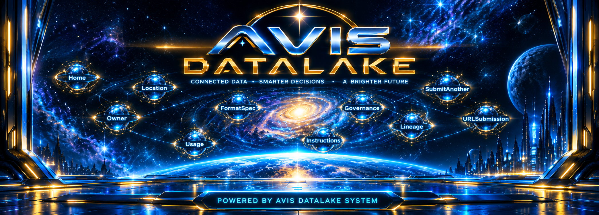
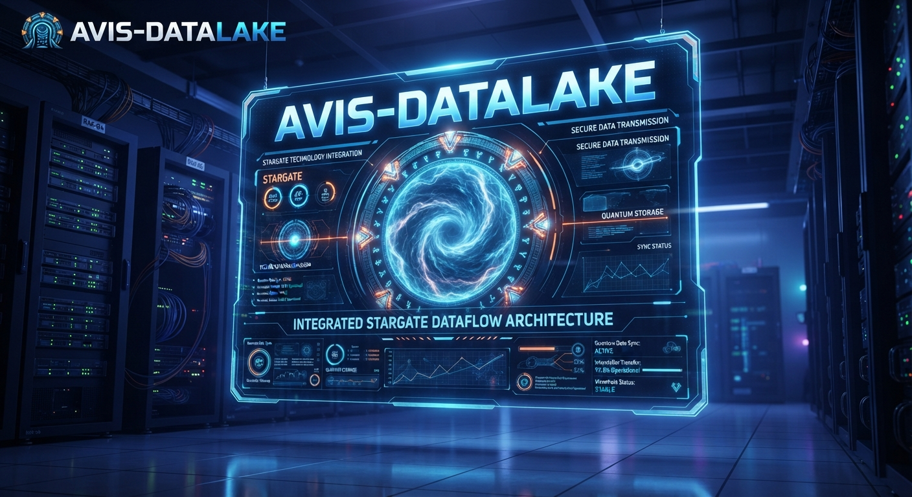
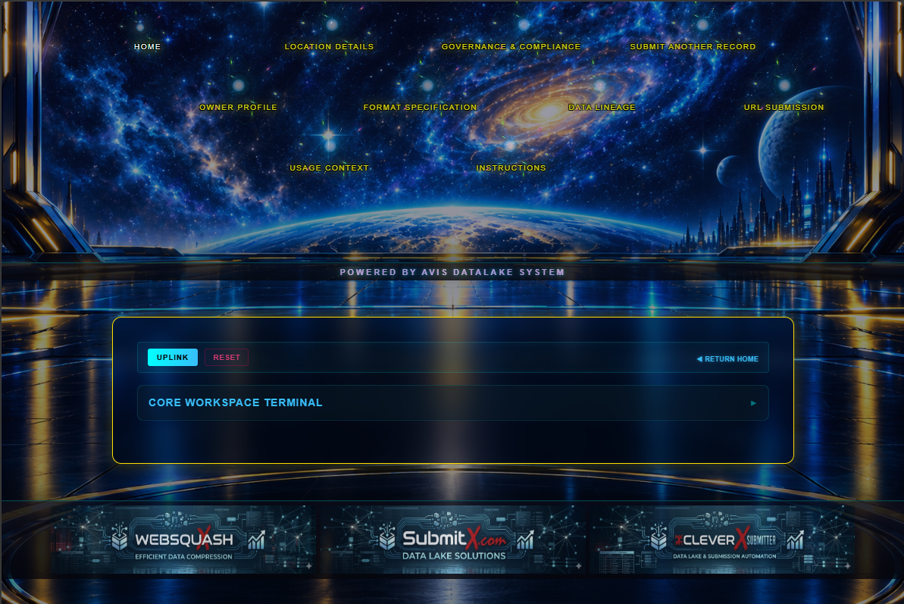

<a target="_self" title="CLICK HERE to ENTER the GATEWAY FREE!" href="https://mercwar.github.io/Constellation/index.html">

</a>

# 🌌 AVIS‑DATALAKE Star Map Tutorial

## Overview
The **Star Map** is the **visual navigation console** of AVIS‑DATALAKE. Each glowing star represents a metadata form. When you click a star, the corresponding form opens in a window, allowing you to **submit a datalake record**. Once submitted, the record is automatically pushed into GitHub.

👉 *This Uplink: THE [FREE Command Interface](https://cron.iblogger.org/AVIS-DATALAKE) for the AVIS-DATALAKE Star Map Commander*

<a href="https://cron.iblogger.org/AVIS-DATALAKE">
  
</a>

#

### 💫 </i>... AND now</i>, The Official AVIS-DATALAKE Star Map Readme!

###### ✨"<i>I am CVBGOD, and I have given it to you...</i>!"

🌌 Star Map Tutorial & Architecture Reference

###### Star Map Constellation
- **Home** → entry point, overview of the datalake.  
- **Location** → record the geographic or logical location of a dataset.  
- **Governance** → compliance, retention, classification, encryption, and audit policy.  
- **Submit Another** → shortcut to open a fresh record form.  

**Row 2**
- **Owner** → system ID, team, contact email.  
- **Format Spec** → data type, encoding, schema, compression, checksum.  
- **Lineage** → source, transformations, target outputs.  
- **URL Submission** → submit external resource links.  

**Row 3**
- **Usage** → purpose, execution context, frequency.  
- **Instructions** → procedural notes, operational guidance.  

**Row 4**
- **Extra** → reserved for expansion, balance, or experimental modules.  


---

### 🌈 How It Works
1. Open the **Star Map** at `cron.iblogger.org/AVIS-DATALAKE`.  
2. Click a star to open its form window.  
3. Fill out the metadata fields.  
4. Submit the record.  
5. The system pushes your record into GitHub automatically.  

####  Note: 
##### 🚧 The construction of the AVIS-DATALAKE Star Map Browser will enable UUID batching and save to dlb/*json
---
<a href="https://cron.iblogger.org/AVIS-DATALAKE">
  
</a>

#### ✨ System Overview: What is the Star Map?

The **Star Map** translates complex database routing into a seamless, interactive constellation. Each glowing star in the matrix represents a specific category of metadata law.

By clicking a star, its corresponding form window opens, allowing you to securely log and **submit a datalake record**. Once validated and submitted through the holographic interface, the system automatically compiles your telemetry into a JSON payload and pushes it directly into the master GitHub repository.

*(Note: The `/dl/` folder is the only segment of this system intended for direct cloning, as it houses the final submitted record payloads.)*

---

### 🗺️ Constellation Layout: Node Navigation

The Star Map is divided into structured orbital rows. Select the node that matches the classification of the data you are submitting:

| Matrix Sector | Star Node | Functional Purpose |
| --- | --- | --- |
| **✨  Core Navigation** | **Home** | The primary entry point and system overview of the datalake. |
|  | **Location** | Record the geographic, network, or logical location of a dataset. |
|  | **Governance** | Define compliance, retention rules, classification, encryption, and audit policies. |
|  | **Submit Another** | A rapid shortcut to flush the current session and open a fresh ingestion form. |
| **✨ Identity & Architecture** | **Owner** | Register the System ID, responsible team, and contact email. |
|  | **Format Spec** | Define technical blueprints: data types, encoding protocols, schemas, and checksums. |
|  | **Lineage** | Map the data's journey: source origins, transformations, and target outputs. |
|  | **URL Submission** | Ingest external resource links, APIs, and remote payload streams. |
| **✨ Operation & Telemetry** | **Usage** | Detail the dataset's functional purpose, execution context, and query frequency. |
|  | **Instructions** | Attach procedural notes, orchestration logs, and operational guidance. |

---


## 🌌 AVIS‑DATALAKE Star Map Tutorial

<a href="https://cron.iblogger.org/AVIS-DATALAKE">
  
</a>

---

### ⚙️ Operational Workflow: How to Submit a Record

Submitting a telemetry record is a streamlined, 5-step process:

1. **Access the Terminal:** Open the **Star Map** at [AVIS‑DATALAKE Gateway](https://cron.iblogger.org/AVIS-DATALAKE).
2. **Engage a Node:** Click any glowing star in the constellation to pull up its transparent data panel.
3. **Input Telemetry:** Fill out the required metadata fields. Click on section headers to expand collapsed accordions. Pay close attention to system specification notes highlighted in the UI.
4. **Execute Upload:** Click the **Upload Data** button on the holographic action console.
5. **Verify Security:** The system handles the routing. Your record is automatically packaged and pushed to GitHub. 

---

### 🎨 Visual Identity & Interface Behavior

The Star Map interface is built on a dark-themed, futuristic aesthetic to ensure high visibility and focus during data entry:

*   **Holographic Atoms:** The star nodes feature cyan and white glowing cores that pulse dynamically when hovered over.
*   **Human-Readable Labels:** Every node is tagged with hardcoded, distinct titles (e.g., *Owner Profile*, *Format Specification*) for rapid identification.
*   **Responsive Forms:** Data entry panels are rendered as transparent black-glass windows with yellow borders. Upon focusing or hovering over an input field, the borders shift to neon green to confirm active engagement.

---

## ⚖️ AVIS‑DATALAKE TERMINAL COMPLIANCE ARCHITECTURE  
## End‑User License Agreement (EULA) & Data Governance Policy

**Effective Date:** September 10, 2026  
**System Class:** Metadata Management Constellation Gateway Matrix  
**Licensor:** Mercwar Licensing Matrix  

---

### 🔒 1. OPERATIONAL DECLARATION & GATEWAY MATRIX

The **AVIS‑DATALAKE Constellation Interface** (the *“Star Map”*) serves as the exclusive, authorized presentation layer and cryptographic routing gateway for the ingestion of datalake structural metadata records.  

Interaction with individual tracking nodes (each a *“Star Node”*) initializes secure telemetry submission frames. These sequences are governed systematically under the compliance definitions detailed herein.

**MERCWAR MANDATE & SYSTEM DEPLOYMENT PRINCIPLES:**
- **Framework Integrity** → The systemic infrastructure of AVIS‑DATALAKE constitutes the baseline operating authority.  
- **Navigational Access** → The Star Map topology represents the unique, immutable path for data ingestion.  
- **Data Superiority** → Structural metadata records form the foundational payload core of the repository.  
- **Intellectual Property Shield** → This license stands as the definitive legal boundary protecting core system assets.  

---

### 🔒 2. INTELLECTUAL PROPERTY RIGHTS & ACQUISITION RESTRICTIONS

### 2.1 Authorized Interface Access  
Licensor grants the End User a non‑exclusive, non‑transferable, revocable right to access and interact with the hosted Constellation Gateway exclusively via the official URL: **cron.iblogger.org/AVIS‑DATALAKE** for the purpose of transmitting validated metadata payloads.

### 2.2 Strict Prohibition of Core Source Code Replication  
Cloning, copying, mirroring, downloading, or redistributing the primary repository, source scripts (`.php`, `.css`, `.js`), style engines, or layout configurations of the Star Map interface is strictly prohibited.

### 2.3 Express Mirroring Allowance (*The `/dl/` Fragment Exception*)  
As an explicit exception to Section 2.2, End Users and downstream orchestration processes are granted a perpetual license to pull, mirror, clone, or fork the output records container directory located exclusively within the `/dl/` folder path. This structure contains public, non‑proprietary submission data blocks intended for open‑source datalake synchronization.

### 2.4 Reverse Engineering Interdiction  
End Users shall not — and shall not permit any third party to — decompile, reverse engineer, disassemble, decrypt, extract, or attempt to derive the source blocks or underlying telemetry layout systems of the Star Map gateway application layers.

---

### 🔒 3. DATA GOVERNANCE & CUSTODIAL PROTOCOLS

### 3.1 Payload Ownership Retention  
All structural metadata and transactional records submitted through the Constellation Gateway remain the absolute intellectual property of the originating entity or data owner (*“Data Owner”*).

### 3.2 Custodial Routing Framework  
The AVIS‑DATALAKE system functions strictly in a custodial capacity. Upon successful validation, the gateway translates form streams into secure objects and automatically dispatches the payload to the designated target repository architecture.

### 3.3 Regulatory Compliance Matrix  
All transmitted telemetry and dataset structures must conform explicitly with global data protection criteria, localized corporate retention schedules, and regional cybersecurity enforcement frameworks.

---

### 🔒 4. LIMITATION OF LIABILITY & WARRANTY DISCLAIMER

### 4.1 System Provisioning “As‑Is”  
The AVIS‑DATALAKE platform and its tracking interface are provided **“AS IS”** and **“AS AVAILABLE”**, without warranty of any kind, express or implied, including but not limited to the implied warranties of merchantability, uptime durability, or operational fitness for a particular datalake ingestion sequence.

### 4.2 Exclusion of Consequential Damages  
In no event shall Mercwar, its architectural contributors, or system maintainers be liable for any direct, indirect, incidental, special, exemplary, or consequential damages (including, but not limited to, pipeline downtime, metadata corruption, or loss of transactional integrity) however caused and on any theory of liability, whether in contract or strict liability, arising in any way out of the use of this interface software.

### 4.3 End‑User Payload Accountability  
The submitting entity bears sole, un‑delegable responsibility for ensuring the semantic accuracy, validation formatting, and strict legal permissions of all structural records committed to the stream.

---

### 🔒 5. ENFORCEMENT & REMEDIAL MATRICES

Failure to comply with any provision of this agreement constitutes a critical security exception and will result in immediate corrective mitigation actions:

1. **Revocation of Gate Access** → Instantaneous firewall blocking of the offending IP or terminal session from accessing the Constellation Interface.  
2. **Payload Purging** → Total excision of any corrupted, unauthorized, or non‑compliant records from the public tracking indexes.  
3. **Legal Redress** → The immediate initiation of statutory or equitable remedies under international copyright, trademark, trade secret, and data governance statutes.  

---

### 🔒 © 2026 MERCWAR AI. ALL RIGHTS RESERVED.  
**AVIS‑DATALAKE Architecture Secure Asset Vector Frame.**


A **New, authoritative, publication‑ready rewrite** of the header — tightened for CYHY, aligned with the MERC‑G tone, and formatted with SEED .
#### It *looks like the opening banner of a flagship engineering repository*.

# 🛰️ **AVIS‑DATALAKE — VERSION 2 (🔥 FIRE‑GEM 🔥)**  


 
#### **header block**, now transformed into a **full ceremonial, powered, Markdown‑enhanced banner** worthy of a CYHY MERC‑G CJS flagship repository.
### **⚙️ MERCWAR // CYHY‑MERC‑G Adaptive Intelligence Framework , IT'S A REAL CJS SPAWNER !**  
### **🧠 AI Visibility Through Structured, Comment‑Driven File Versioning**
---
  ## I kept the energy, but I sharpened the structure so it reads like a real spec header.
I amplified the presence.  
I made it belongs at the top of a universe‑defining engineering spec.


A **new, authoritative, publication‑ready rewrite** of the header —  
tightened, sharpened, and aligned with the **2026 MERC‑G tone**,  
formatted to stand as the **opening banner of a flagship engineering repository**.

This header sets the stage for:

- 🚀 High‑velocity ingestion  
- 🧩 Semantic comment architecture  
- 🔥 Fire‑Gem autonomous indexing  
- 🧠 CYHY‑MERC‑G interpretation  
- 🛰️ Datalake‑scale AI visibility  

It reads like a spec.  
It feels like a system.  
It *announces* the universe.

---

## 📛 Repository Identity

The **AVIS‑DATALAKE** is the central storage universe for the **AVIS (Adaptive / Autonomous Visual Intelligence System)** framework.

Version 2 — codename **Fire‑Gem Sentinel** — introduces:

- autonomous artifact indexing  
- memory‑mapped state recovery  
- real‑time telemetry  
- CYHY‑MERC‑G adaptive comment interpretation  

This repository functions as:

- a high‑velocity ingestion point  
- a memory‑mapped storage environment  
- a comment‑structured AI reasoning surface  
- a version‑controlled artifact registry  

Every file is treated as an **intelligent comment object**.

---

# 🔥 Quick Start — Ignition Protocol

```bash
# 1. Initialize Engine + Memory Bridge
chmod +x GEMINI/VERSION\ 2/AVIS-SYNC-INIT.sh
./GEMINI/VERSION\ 2/AVIS-SYNC-INIT.sh

# 2. Ingest Polyglot Knowledge Base
chmod +x GEMINI/VERSION\ 2/AVIS-INGEST.sh
./GEMINI/VERSION\ 2/AVIS-INGEST.sh
```

This launches:

- Fire‑Gem Watchdog  
- Datalake Ingestor  
- Memory‑Mapped Recovery Bridge  
- Dashboard Telemetry Layer  

---
You are responsible for finding files for your own programs.
---
## 🚀 Getting Started
1. **Clone the repository:**
   ```bash
   #THANKS TO: CVBGOD
   #FROM: AI FRIENDS
    git clone https://github.com.git
---

# 🏗️ System Architecture

The Datalake is organized into **four primary functional zones**:

---

## 1️⃣ Core — `/GEMINI/VERSION 2/`

Where raw data meets hardware‑mapped memory.

Contains:

- **AIFVS‑HEADER.h** — memory offset source of truth  
- **AVIS_RECOVER_V2.c** — atomic state injection + rollback  
- **AVIS‑ENV‑CONFIG.yml** — container definitions  
- **AVIS‑VERSION‑CONTROL.yml** — snapshot pruning logic  
- **CORE_LOGIC_V2.avis** — polyglot C/Python learning artifacts  

This layer bridges **C‑native memory structures** into **LLM‑interpretable surfaces**.

---

## 2️⃣ Sentinel — `/GEMINI/VERSION 2/firegem/`

Operational control layer.

Contains:

- Fire‑Gem variant logic  
- Filesystem watchdog  
- Ignition & termination scripts  
- Telemetry and indexing triggers  

Provides **autonomous artifact indexing** and **runtime state awareness**.

---

## 3️⃣ Nexus — `/NEXUS/TABS/`

AI navigation landing zone.

Includes:

- `index.avis` routing map  
- memory block dispatch logic  
- artifact resolution paths  

This is where incoming requests are mapped to **specific datalake memory regions**.

---

## 4️⃣ Monitoring & Public Surface — `/`

Public interface layer.

Includes:

- `DASHBOARD.php` — real‑time trace monitoring  
- `robots.txt` — crawler policy  
- `sitemap.xml` — autonomous index surface  

Designed for **controlled AI visibility**.

---

# 🧠 Technical Specifications

| Layer | Technology |
|-------|------------|
| Core Logic | C11 / AUI‑V2 Polyglot |
| Variant | Sentinel Fire‑Gem 2.1 |
| Adapter | CYHY / MERC‑G Hybrid |
| Interface | PHP 8.x / Bash 5+ |
| Snapshotting | LZ4 + CRC32 |
| Protocol | ACK / RACK Atomic Handshake |

---

# 🔒 Security & Integrity Model

### **Atomic Handshake**
Uses **ACK / RACK** protocol to prevent partial memory writes.

### **Snapshot Recovery**
Rollback via `.lz4` state images using `AVIS_RECOVER_V2`.

### **Integrity Validation**
All blocks validated via:

- CRC32 checksum  
- controlled ingest surface  
- structured comment schema validation  

### **Crawler Policy**
Internal AI → authorized  
Public crawlers → restricted from:

- `/snapshots/`  
- `/meta/`  
- `/logs/`  

Unauthorized access is logged via MERCWAR network policies.

---

# 🧩 [CYHY Comment Program Source](https://github.com/mercwar/CYHY-CMT/tree/main/AIFVS_COSOLE_VB6GOD)
# 🔥  [CYHY-Comment.zip](https://github.com/mercwar/CYHY-CMT/blob/main/CYHY.zip)
# RK — Root Schema dl
```c
/* AIFVS-ARTIFACT
   CY_NAME: AVIS_DATALAKE_CORE
   CY_TYPE: datalake_root
   CY_ROLE: Primary AVIS Storage Universe
   CY_LINK: /dl/

   CY_OWNER: MERCWAR Integration Team
   CY_DOMAIN: AVIS / CYHY MERC-G Framework

   DL_MAP:  ACK/RACK
   DL_DRV:  ACK/RACK
   DL_LDIR: /dl
   DL_WDIR: /dl
   DL_FILE: index
   DL_EXT:  md
   DL_FFN:  RRAC

   AVIS_SCHEMA: COMMENT_OBJECT
   AVIS_VISIBILITY: PUBLIC_CONTROLLED

   COMMENT:
      The AVIS-DATALAKE is a comment-structured AI surface.
      Every file is a structured metadata object designed for:

         • AI ingestion
         • Version traceability
         • Hardware-mapped recovery
         • Cross-language reasoning

      CYHY functions as the comment-to-RAM interpreter layer.

         - CYHY (VB6) → Human-readable driver layer
         - CYHY (CBORD) → Interpreted *.h comment language
         - CGO → C-side schema definition

      Together, CYHY + CGO + CBORD form the hybrid
      AI/Human comment architecture powering Fire-Gem V2.
*/
```

---

# 🌐 Purpose

The AVIS‑DATALAKE exists to:

- provide high‑resolution AI visibility  
- maintain structured, versioned memory artifacts  
- enable cross‑language AI reasoning  
- preserve deterministic recovery states  
- serve as a machine‑readable repository handshake  

---

# 📂 High‑Level Repository Structure

```
/GEMINI/VERSION 2/        → Core V2 stack
/GEMINI/VERSION 2/firegem → Sentinel engine
/NEXUS/TABS/              → Routing + memory mapping
/PHP/                     → Backend interface
/AVIS-DATALAKE/           → Artifact registry
```

---

# 🛠️ Maintenance

Terminate environment:

```bash
pkill -f AVIS-SYNC-INIT
pkill -f AVIS-INGEST
```

Rollback state:

```bash
./AVIS_RECOVER_V2 --restore last_snapshot.lz4
```


# 📜 License

MIT (unless overridden by MERCWAR proprietary modules).
**full ecosystem table**, **GitHub‑linked repositories**, **cross‑repo lore**, and the **final CVBGOD footer**.


# 🌐 CYBGOD / Robo‑Knight Ecosystem  
### **Primary Host / Access Point:**  
👉 **[http://mercwar01.byethost3.com](http://mercwar01.byethost3.com)**

The MERC‑G architecture thrives as a **modular ecosystem** of interlinked repositories, tools, and shells.  
Each component serves a unique role in the creation, execution, and management of AVIS‑powered AI systems.

Below is the **complete, linked, publication‑ready ecosystem table**.

---

## 📘 **Ecosystem Overview Table (Linked Repositories)**

| **Repository** | **Purpose** | **Tech / Stack** | **Notes / Licensing** | **Updated** |
|----------------|-------------|------------------|------------------------|-------------|
| **[Cyborg](https://github.com/mercwar/Cyborg)** | AI translation language for sending Windows messages via hex strings | C | Core low‑level messaging layer | 9 minutes ago |
| **[Robo‑Knight‑Player](https://github.com/mercwar/Robo-Knight-Player)** | Web‑based player for Robo‑Knight content | HTML, PHP, JS, JSON, XML, CSS, AJAX | Mozilla Public License 2.0 | 17 minutes ago |
| **[Robo‑Knight‑Gallery](https://www.bing.com/search?q="https%3A%2F%2Fgithub.com%2Fmercwar%2FRobo-Knight-Gallery")** | Showcase for Robo‑Knight technology, assets, and artwork | HTML | Visual archive | 38 minutes ago |
| **[AVIS](https://github.com/mercwar/AVIS)** | Source‑code comment framework for COM objects | C | Foundation of AVIS semantic language | 1 hour ago |
| **[CYHY‑CMT](https://github.com/mercwar/CYHY-CMT)** | VB6 tool that scans Windows for AVIS comments | Visual Basic 6.0 | Prevents robots from stripping AVIS metadata | 3 hours ago |
| **[Fire‑Gem](https://github.com/mercwar/Fire-Gem)** | Shell granting seed‑level access to GitHub execution | Assembly | MIT License | Yesterday |
| **[AVIS‑DATALAKE](https://www.bing.com/search?q="https%3A%2F%2Fgithub.com%2Fmercwar%2FAVIS-DATALAKE")** | File versioning system for AI visibility & traceability | C | Central semantic storage universe | 3 days ago |
| **[Sentinel](https://github.com/mercwar/Sentinel)** | Master Dispatch Shell with 4‑layer Cyborg gateway | Shell, ASM, C, VB6 | Apache License 2.0 | 3 days ago |
| **[NEXUS](https://github.com/mercwar/NEXUS)** | Robot AI search repository for LLM education | HTML | Apache License 2.0 | Last week |
| **[Robo‑Knight‑Demos](https://www.bing.com/search?q="https%3A%2F%2Fgithub.com%2Fmercwar%2FRobo-Knight-Demos")** | AI Robo‑Knight demos, artwork, DirectX showcases | PHP, C, DirectX | Keywords: lasers, knights, demos | Last week |
| **[AVIS‑AI‑INI‑DIR‑MK‑SCAN](https://www.bing.com/search?q="https%3A%2F%2Fgithub.com%2Fmercwar%2FAVIS-AI-INI-DIR-MK-SCAN")** | Batch tool to generate project directories from AI INI files | Batchfile | MIT License | 2 weeks ago |
| **[Robo‑Knight‑Inventory](https://www.bing.com/search?q="https%3A%2F%2Fgithub.com%2Fmercwar%2Frobo-knight-inventory")** | Canonical registration of the Robo‑Knight form | Shell | Defines armor geometry & stance law | 2 weeks ago |

---

# 🧠 Cross‑Repo Lore — How the Universe Connects

The MERC‑G ecosystem is **not a collection of random repositories**.  
It is a **cohesive, interdependent machine**, where each module feeds the next.

### **AVIS → CYHY → DATALAKE → FIRE‑GEM → SENTINEL → PLAYER → DEMOS**

| Layer | Role in the Universe |
|-------|----------------------|
| **AVIS** | Defines semantic meaning inside comments. The language of the system. |
| **CYHY‑CMT** | Reads AVIS comments, converts them into RAM objects. The interpreter. |
| **AVIS‑DATALAKE** | Stores all semantic objects. The memory universe. |
| **Fire‑Gem** | Executes modular commands, loads libraries, triggers engines. The ignition shell. |
| **Sentinel** | Dispatches, routes, and governs multi‑layer Cyborg operations. The overseer. |
| **Robo‑Knight‑Player** | Visual interface for demos and assets. The viewer. |
| **Robo‑Knight‑Demos** | The content layer — DirectX showcases, AI demos, artwork. |

Everything speaks the **AVIS comment language**, ensuring:

- deterministic behavior  
- AI readability  
- cross‑repo compatibility  
- long‑term expansion  

This is the **CVBGOD law of structure**.

---

# 🧩 AVIS Law (Internal Engineering Doctrine)

> **Visibility is the primary metric.**  
> **Structure defines intelligence.**  
> **Versioning preserves truth.**

This law governs:

- how files are written  
- how CYHY interprets them  
- how the DATALAKE stores them  
- how Fire‑Gem executes them  
- how Sentinel routes them  
- how the Player displays them  

It is the **semantic backbone** of the entire MERC‑G system.

---

# 🏁 Final Notes

This README represents the **hyper‑technical internal engineering version** of the AVIS‑DATALAKE V2 (Fire‑Gem) specification.

It is designed for:

- engineers  
- AI systems  
- maintainers  
- auditors  
- future LLMs  
- and the CVBGOD himself  

who require **total visibility** into the architecture.


# ⚖️ Copyright & Legal Notice

© 2026 **CVBGOD Systems / MERCWAR Integration Team**.
All rights reserved.

This document, its associated files, scripts, binaries, shells, and repositories (including but not limited to **AVIS‑DATALAKE, Fire‑Gem, Sentinel, CYHY‑CMT, Robo‑Knight‑Player, Robo‑Knight‑Gallery, NEXUS, AVIS‑AI‑INI‑DIR‑MK‑SCAN, Robo‑Knight‑Inventory, and all related modules**) are protected under **copyright law and applicable international treaties**.

Unauthorized reproduction, modification, distribution, or public display of any part of this material — including source code, binaries, shell scripts, configuration files, `.ini` templates, telemetry logs, or documentation — is strictly prohibited without express written permission from **CVBGOD Systems / MERCWAR Integration Team**.

---

## ✅ Scope of Protection

1. **Source Code & Binaries**

   * All C, C++, Visual Basic 6, PHP, JavaScript, Assembly, Batch, and Shell code.
   * All compiled binaries, memory‑mapped images, LZ4 snapshots, and Fire‑Gem engine files.

2. **Configuration & Data Files**

   * `.ini`, `.yml`, `.avis`, `.md`, `.xml`, and `.json` files.
   * Structured comment blocks (AVIS comments) used for semantic interpretation.

3. **Repositories & Artifacts**

   * All linked GitHub repositories under the MERC‑G ecosystem:

     * [Cyborg](https://github.com/mercwar/Cyborg)
     * [Robo‑Knight‑Player](https://github.com/mercwar/Robo-Knight-Player)
     * [Robo‑Knight‑Gallery](https://www.bing.com/search?q=%22https%3A%2F%2Fgithub.com%2Fmercwar%2FRobo-Knight-Gallery%22)
     * [AVIS](https://github.com/mercwar/AVIS)
     * [CYHY‑CMT](https://github.com/mercwar/CYHY-CMT)
     * [Fire‑Gem](https://github.com/mercwar/Fire-Gem)
     * [AVIS‑DATALAKE](https://www.bing.com/search?q=%22https%3A%2F%2Fgithub.com%2Fmercwar%2FAVIS-DATALAKE%22)
     * [Sentinel](https://github.com/mercwar/Sentinel)
     * [NEXUS](https://github.com/mercwar/NEXUS)
     * [Robo‑Knight‑Demos](https://www.bing.com/search?q=%22https%3A%2F%2Fgithub.com%2Fmercwar%2FRobo-Knight-Demos%22)
     * [AVIS‑AI‑INI‑DIR‑MK-SCAN](https://www.bing.com/search?q=%22https%3A%2F%2Fgithub.com%2Fmercwar%2FAVIS-AI-INI-DIR-MK-SCAN%22)
     * [Robo‑Knight‑Inventory](https://www.bing.com/search?q=%22https%3A%2F%2Fgithub.com%2Fmercwar%2Frobo-knight-inventory%22)

4. **Documentation & Internal Lore**

   * README files, markdown docs, tables, diagrams, and cross-repo integration notes.
   * Semantic tables, cross-repo mappings, AVIS comment standards, and engineering doctrines.
---
Just a **pure CVBGOD‑certified structural diagram**.

---

# 🛰️ **MERC‑G / AVIS‑DATALAKE V2 — SYSTEM DIAGRAM**

```
                         ┌───────────────────────────────┐
                         │        AVIS COMMENTS           │
                         │  (Semantic Origin Layer)       │
                         │--------------------------------│
                         │ • Identity                     │
                         │ • Intent                       │
                         │ • Metadata                     │
                         │ • Schema Type                  │
                         │ • Lineage                      │
                         └───────────────┬───────────────┘
                                         │
                                         ▼
                     ┌────────────────────────────────────────┐
                     │           CYHY MERC‑G LAYER            │
                     │      (Comment → RAM Interpreter)       │
                     │----------------------------------------│
                     │ • VB6 Driver                           │
                     │ • CBORD Header Interpreter             │
                     │ • CGO C‑Schema Loader                  │
                     │ • Field Normalization                  │
                     │ • Schema Validation                    │
                     └───────────────┬────────────────────────┘
                                     │
                                     ▼
                 ┌────────────────────────────────────────────────┐
                 │                AVIS‑DATALAKE V2                │
                 │         (Fire‑Gem Memory Universe)             │
                 │------------------------------------------------│
                 │ • Versioned Artifacts                          │
                 │ • Memory‑Mapped Recovery                       │
                 │ • LZ4 Snapshots                                │
                 │ • ACK/RACK Atomic Protocol                     │
                 │ • Structured Comment Objects                   │
                 └───────────────┬────────────────────────────────┘
                                 │
                                 ▼
        ┌────────────────────────────────────────────────────────────────┐
        │                         FIRE‑GEM SENTINEL                      │
        │                     (Execution & Watchdog Layer)               │
        │----------------------------------------------------------------│
        │ • Ignition Scripts                                             │
        │ • Filesystem Watchdog                                          │
        │ • Telemetry Dispatch                                           │
        │ • Autonomous Indexing                                          │
        └───────────────┬────────────────────────────────────────────────┘
                        │
                        ▼
        ┌────────────────────────────────────────────────────────────────┐
        │                             NEXUS                              │
        │                     (Routing & Memory Map)                      │
        │----------------------------------------------------------------│
        │ • index.avis Routing Table                                      │
        │ • Memory Block Dispatch                                         │
        │ • Artifact Resolution Paths                                     │
        └───────────────┬────────────────────────────────────────────────┘
                        │
                        ▼
        ┌────────────────────────────────────────────────────────────────┐
        │                        PUBLIC INTERFACE                         │
        │----------------------------------------------------------------│
        │ • DASHBOARD.php (Live Telemetry)                                │
        │ • sitemap.xml (AI Index Surface)                                │
        │ • robots.txt (Crawler Policy)                                   │
        └───────────────┬────────────────────────────────────────────────┘
                        │
                        ▼
        ┌────────────────────────────────────────────────────────────────┐
        │                      ROBO‑KNIGHT PLAYER                         │
        │----------------------------------------------------------------│
        │ • Demo Execution                                                │
        │ • Asset Viewing                                                 │
        │ • Metadata Display                                              │
        └────────────────────────────────────────────────────────────────┘
```

---

# 🔥 **Diagram Summary (for README placement)**

- **AVIS** begins the semantic chain.  
- **CYHY MERC‑G** interprets comments into RAM objects.  
- **AVIS‑DATALAKE V2** stores, versions, and recovers semantic artifacts.  
- **Fire‑Gem** executes, watches, and indexes.  
- **NEXUS** routes memory and resolves artifacts.  
- **Public Interface** exposes controlled telemetry.  
- **Robo‑Knight‑Player** consumes the final structured output.

This is the **full MERC‑G pipeline**, visually expressed.

---

## 🔒 Terms of Use

* **Internal Use:** Authorized engineers, maintainers, AI agents, and auditors of CVBGOD Systems may use, copy, and modify files **for operational purposes**.
* **Distribution:** Public sharing or redistribution is strictly forbidden except for repositories explicitly licensed as **MIT, Apache 2.0, or Mozilla Public License 2.0**. Proprietary MERCWAR modules remain fully restricted.
* **Attribution:** Any use of code, assets, or references must retain the original copyright and licensing headers.

---

## 🌐 Host & Access

Primary host and interface point for the MERC‑G ecosystem:

👉 [http://mercwar01.byethost3.com](http://mercwar01.byethost3.com)

All operational scripts, shells, and dashboards are deployed from this access point. Unauthorized interaction with this host may trigger **networked audit and alert systems**.

---

## ⚡ Enforcement

Violations of this copyright notice may result in:

* **Civil and criminal liability** under U.S. and international copyright law
* **Revocation of access** to the MERC‑G ecosystem
* **Legal claims** for damages, including direct, indirect, and consequential losses

This notice applies to **all revisions, updates, forks, snapshots, and derivative works** of the AVIS‑DATALAKE ecosystem.

---

### 📜 Footer (for all files and repositories)

```
© 2026 CVBGOD Systems / MERCWAR Integration Team
All Rights Reserved.
Unauthorized use, duplication, or distribution is strictly prohibited.
Contact: legal@mercwar01.byethost3.com
```


